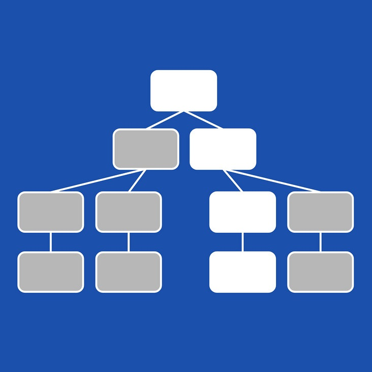

# 变化检测(脏检查)学习

## 什么是变化检测(Change Detection)

> 在应用的开发过程中，state 代表需要显示在应用上的数据。当 state 发生变化时，往往需要一种机制来检测变化的 state 并随之更新对应的界面。这个机制就叫做 Change Detection 机制。
> 
> 在 WEB 开发中，更新应用界面其实就是对 DOM 树进行修改。由于 DOM 操作是昂贵的，所以一个效率低下的 Change Detection 会让应用的性能变得很差。因此，框架在实现 Change Detection 机制上的高效与否，很大程度上决定了其性能的好坏。

## Ng是如何实现变化检测

**组件树 + 单项数据流**
> 组件化是现在前端发展的主要趋势之一，每一个页面都是由一个个组件组成的，这些组件构成一颗组件树。在常规情况下，Angular 依旧使用的 Dirty Checking，也就是被大家说厌了的脏查询。Angular 会从根组件开始，逐一检测每一个组件。Angular Change Detection 是基于组件树的单向数据流来实现的。组件树+单项数据流使得 Angular 在检测每一个组件时不需要考虑当前组件会修改父组件的数据。



> 在 Angular 中每个组件都有自己的变化检测器，这使得我们可以对每个组件分别控制如何以及何时进行变化检测。

## markForCheck()说起


``` js
export class ViewRef{
    ...
    markForCheck(): void {
        markViewDirty(this._cdRefInjectingView || this._lView);
    }

}

```
[查看源码](../sources/core/src/render3/view_ref.ts)

``` js
export function markViewDirty(lView: LView): LView|null {
  while (lView) {
    lView[FLAGS] |= LViewFlags.Dirty;
    const parent = getLViewParent(lView);
    // Stop traversing up as soon as you find a root view that wasn't attached to any container
    if (isRootView(lView) && !parent) {
      return lView;
    }
    // continue otherwise
    lView = parent!;
  }
  return null;
}
```
[查看源码](../sources/core/src/render3/instructions/shared.ts)

``` js
export const enum LViewFlags {
  InitPhaseStateIncrementer = 0b00000000001,
  InitPhaseStateMask = 0b00000000011,
  CreationMode = 0b00000000100,
  FirstLViewPass = 0b00000001000,
  CheckAlways = 0b00000010000,
  ManualOnPush = 0b00000100000,
  Dirty = 0b000001000000,
  Attached = 0b000010000000,
  Destroyed = 0b000100000000,
  IsRoot = 0b001000000000,
  RefreshTransplantedView = 0b0010000000000,
  IndexWithinInitPhaseIncrementer = 0b0100000000000,
  IndexWithinInitPhaseShift = 11,
  IndexWithinInitPhaseReset = 0b0011111111111,
}

```
[查看源码](../sources/core/src/render3/interfaces/view.ts)
<!-- D:\Leon\AppCode\angular\leon-ng-source-learn\sources\core\src\render3\interfaces\view.ts -->
